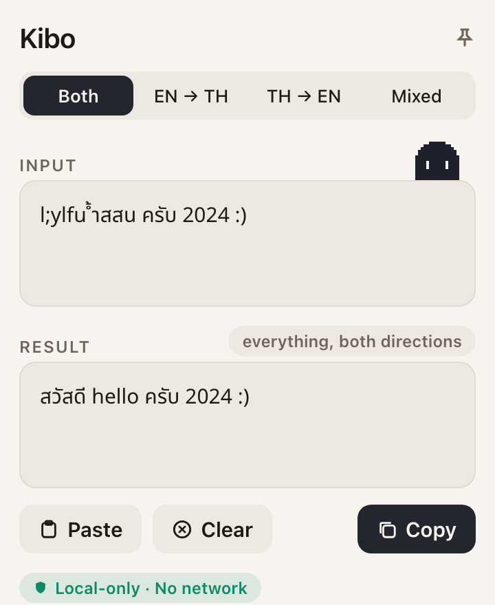

# Kibo

**Who Forgot To Change Lang** · ใครลืมเปลี่ยนภาษา — a macOS menu-bar ghost that fixes text you
typed with the wrong keyboard layout, Thai Kedmanee ↔ US QWERTY.

[](https://github.com/pmrster/kibo/releases/latest/download/Kibo.dmg)

<sub>First launch shows a macOS security prompt (not yet notarized) — open it via **System Settings → Privacy & Security → Open Anyway**. [Full steps ↓](#download)</sub>

[](LICENSE)
&nbsp;[](#download)
&nbsp;[](#run-from-source)
&nbsp;[](PRIVACY.md)

<p align="center">
  <picture>
    <source media="(prefers-color-scheme: dark)" srcset="docs/kibo-idle-dark.gif">
    
  </picture>
</p>

Type `l;ylfu` when you meant `สวัสดี`? Paste it in and get it back.

```
l;ylfu ้ำสสน ครับ 2024 :)   →   สวัสดี hello ครับ 2024 :)
```

Note what *didn't* change. `ครับ` was already correct, `2024` is a number, `:)` is a smiley. Mixed
mode converts only the parts that are actually broken — and when you switched layout halfway
through a sentence, so half of it is wrong each way, **Both** fixes both halves in one pass.

It is **local-only, sandboxed, and has no network entitlement**. Kibo reads the clipboard only
when you press Paste, writes it only when you press Copy, and stores nothing you type. The
sandbox makes "no network" something the kernel enforces rather than a promise in a README —
see [Privacy](#privacy) for how to check each claim yourself.

<p align="center">
  <picture>
    <source media="(prefers-color-scheme: dark)" srcset="docs/mockup-converter-dark.png">
    
  </picture>
</p>
<p align="center"><sub>The converter. Kibo perches on the input field, blinks while it waits, and says <i>boo~</i> after a copy.</sub></p>

> Mockup, rendered from the app's own palette and sprite by `Tools/make-mockups.py`. Real
> captures will replace it.

*Kedmanee is the standard Thai keyboard layout, the one every Thai Mac ships with. Its keys sit
where a US QWERTY keyboard puts letters and punctuation, so forgetting to switch layouts turns
what you typed into an unrelated string of the other script — never a blank, always wreckage.*

## What it does

The app has no Dock icon. Look for the small pixel ghost in the menu bar — that's **Kibo**.

- **Left-click** the glyph to open the converter. Paste, read the result, copy.
- **Right-click** for About, Settings, and Quit.
- **Pin** (top-right of the window, or `⇧⌘P`) floats the converter above other apps, so it stays
  put while you switch away to paste.
- **Fix it where it is.** Select mistyped text in any app, right-click → **Services** → **Fix
  Layout with Kibo**, and the selection is replaced in place, in whatever mode the converter is
  set to. There is no preview on this path, so `⌘Z` in that app is the undo. To make it a hotkey,
  give it a shortcut in System Settings → Keyboard → Keyboard Shortcuts → Services → Text.
- **Open at login** is a switch in Settings, off by default.

### Four modes

| Mode | Key | What it does |
| --- | --- | --- |
| **Both** | `⌘1` | Flips every run the way its own script implies, in one pass — for text mistyped in *both* directions at once. |
| **EN → TH** | `⌘2` | Treats the whole string as English keystrokes typed with the Thai layout on. |
| **TH → EN** | `⌘3` | The reverse. |
| **Mixed** | `⌘4` | Converts only the runs that look wrong. Leaves correct text, numbers, and punctuation alone. |

Kibo opens in **Both**, and reopens in whatever mode you last used. Hover a mode for a Thai
explanation of what it does — the labels are too short to say it, and the difference that matters
(Both converts correct text, Mixed spares it) is worth spelling out.

The first three are mechanical — they flip everything, no judgement — and they are the escape
hatch for when Mixed guesses wrong.

### Shortcuts

Everything happens as you type, and the whole flow works without a mouse:

| Action | Shortcut |
| --- | --- |
| Copy result | `⇧⌘C` |
| Paste | `⇧⌘V` |
| Clear | `⇧⌘K` |
| Swap direction | `⇧⌘S` |
| Pin as floating window | `⇧⌘P` |
| Change mode | `⌘1` – `⌘4` |

### How Mixed decides

Thai spelling has hard structural rules, and typing English on the Thai layout breaks them almost
immediately — vowel marks land with no consonant to attach to:

```
"email" typed on the Thai layout  →  ำทฟรส
                                     ↑ a vowel mark with nothing to attach to → broken → converted

ครับ                                 ค(consonant) ร(consonant) ั(mark, attached) บ(consonant)
                                     → every rule satisfied → left alone
```

No dictionary is involved, which matters: written Thai has no spaces, so `สวัสดีครับ` arrives as a
single run and a dictionary would need to segment it first.

**Mixed is tuned to never break correct text, which means it misses things.** Wreckage that
happens to be well-formed passes through — `แนกำ` (which was "code") breaks no rule, and `นา`
(which was "ok") is a real Thai word.

| | |
| --- | --- |
| Correct text left untouched | **36 of 36** sampled — acronyms, URLs, paths, code, English, numbers, Thai |
| English mistypings fixed | **19 of 30** sampled |
| Thai mistypings fixed | **4 of 12** sampled |

That ordering is deliberate: leaving a mistyping is recoverable — you see it and switch to an
explicit mode — whereas mangling text you'd typed correctly is not. All three figures are measured
by `MeasuredAccuracyTests`, which fails if any of them changes, and every case is also written
into `Fixtures/conversion-cases.json` so a port has to hold the same line. Three obvious ways to
raise recall were measured and rejected; `CLAUDE.md` records them so nobody tries a fourth time
without new evidence.

## Privacy

Kibo is the kind of tool you paste a password into, having typed it with the wrong layout. It is
built on that assumption.

- **No network — enforced, not promised.** The app runs in the macOS App Sandbox with no network
  entitlement, so it *cannot* open a connection. Check the running app yourself:
  `lsof -a -p $(pgrep -x Kibo) -i` — no output means no sockets. (The `-a` matters: without it
  `lsof` ORs its filters and shows you every other program's network activity.)
- **The clipboard is touched only when you ask.** Read on Paste, written on Copy, never watched or
  polled. Copies are marked *concealed* and *transient*, the flags clipboard managers use to keep
  passwords out of their history. The Services item never touches the clipboard at all: macOS
  hands the selection over on a private pasteboard that exists for that one call.
- **Nothing you type is stored.** Preferences hold your theme, text size, and last mode. That's
  it. Window restoration is switched off so the text cannot reach disk that way either.
- **One caveat, honestly.** Right-clicking inside a text field gives you the standard macOS menu,
  which includes Look Up and Translate — both send the selected text to Apple. Kibo neither uses
  nor can see that; it is the OS's menu, and it acts only when you pick an item from it.

See [`PRIVACY.md`](PRIVACY.md) for the full account and how to verify each claim, and
[`SECURITY.md`](SECURITY.md) for how to report a problem privately.

## Download

[**⬇ Download Kibo.dmg**](https://github.com/pmrster/kibo/releases/latest/download/Kibo.dmg)
— latest release, macOS 14 (Sonoma) or later, Apple silicon or Intel. Open the `.dmg` and drag
**Kibo** into the **Applications** folder shown in the window.

Builds are ad-hoc signed until a Developer ID is provisioned, so — like any app distributed
outside the App Store — macOS shows a security prompt on first launch. Open it once using Apple's
standard step (no Terminal):

1. Double-click **Kibo** → at the prompt, click **Done**.
2. **System Settings → Privacy & Security** → scroll to the Kibo message → **Open Anyway** → **Open**.

It launches normally after that. (On macOS 14: right-click the app → **Open** → **Open** also works.)

Every release carries a `.sha256` beside the DMG; checksums and previous versions are on the
[releases page](https://github.com/pmrster/kibo/releases). Prefer to build it yourself? See
[Build it yourself](#build-it-yourself) — the result is the same app.

## Build it yourself

No release automation yet — the `.dmg` is a manual `package.sh` run:

```bash
swift test                  # the suite is the accuracy contract — see above
Packaging/package.sh 0.3.0  # → dist/Kibo.app + dist/Kibo-0.3.0.dmg (+ Kibo.dmg, + .sha256)
open dist/
```

The script injects the version and build number, builds the icon from `icon.png`, signs with
the sandbox entitlement, and **refuses to produce a build whose signature lacks the sandbox**.
For a public release build, require Developer ID signing and notarization:

```bash
SIGN_IDENTITY="Developer ID Application: Your Name (TEAMID)" \
NOTARY_PROFILE="kibo-notary" \
REQUIRE_NOTARIZATION=1 \
Packaging/package.sh 0.3.0
```

## Run from source

Requirements: **macOS 14+** and **Swift 6 / Xcode 16+**. This is a SwiftPM package — there is no
`.xcodeproj`, no `package.json`, and no dependencies.

```bash
swift build
swift test                # full suite, all in KiboCoreTests
swift run Kibo            # the glyph appears top-right; quit with pkill -x Kibo

# Render the UI to PNGs without a display, for design review (light + dark):
swift run -Xswiftc -DKIBO_SNAPSHOT Kibo --snapshot ./assets
```

The Services item and Open at login need a real `.app` bundle, so neither works under
`swift run`; use `Packaging/package.sh` and copy the result to `/Applications` to try them.

## How it works

```
input ──▶ RunSplitter ──▶ RunJudge ──▶ KedmaneeMapping ──▶ output
             (runs)      (convert?)      (per key)
```

- **The key table is not hand-written.** `KedmaneeMapping` is dumped from macOS's own layout
  data by `swift Tools/dump-kedmanee.swift`, which asks the system what each physical key produces
  under the US and Thai layouts. That is how two keys a hand table had backwards were caught.
- **`RunSplitter`** cuts the input into maximal runs of Thai, Latin, or neither, which always
  rejoin to the input exactly. **`RunJudge`** decides per run whether it is malformed in its own
  script — the dictionary-free gate Mixed mode uses. The explicit directions and Both skip it.
- **Everything walks Unicode scalars, never `Character`s.** Thai combining marks fuse with the
  consonant before them, so `สวัสดี` is six scalars but four Characters; a per-Character loop
  would silently pass text through unconverted.
- **The OS rewrites keystrokes before the converter sees them.** macOS turns a typed `'` into `’`,
  and `'` is `ง` on Kedmanee. `TypographicSubstitutes` folds those back — only on text actually
  being converted, so text Mixed spares keeps its curls.

### Architecture

Two SwiftPM targets with a deliberate split:

- **`KiboCore`** — all logic, zero AppKit/SwiftUI. Dependencies are injected (the clipboard, the
  settings store), so it is fully unit-tested without a running app.
- **`Kibo`** — the thin SwiftUI/AppKit shell: status item, popover and pinned panel, Services
  entry point, the mascot.

`Fixtures/conversion-cases.json` is a language-neutral behaviour contract: the full 94-key
table, the typographic substitutions, a `schema` block describing the format, and 136 cases across
all four modes — every string in the precision corpus and every known miss. A future Windows port
has to pass the same file, and passing it means holding the same accuracy figures.

| Path | What |
| --- | --- |
| `Sources/KiboCore/` | All logic, zero AppKit/SwiftUI. Fully unit-tested. |
| `Sources/Kibo/` | The SwiftUI/AppKit shell: status item, panel, views, the mascot. |
| `Windows/` | The .NET port: `Kibo.Core` (the same engine in C#), its tests, the WPF shell, and `package.ps1`. |
| `Tests/KiboCoreTests/` | The suite, including the pinned accuracy corpus. |
| `Fixtures/` | The portable behaviour contract. |
| `Packaging/` | `package.sh`, `Info.plist`, the sandbox entitlements. |
| `Tools/` | The key-table dump, and the renderers for the download button, banner, mockups and ghost GIFs. |
| `docs/` | The button, banner, mockups and GIFs this README uses. |

`CLAUDE.md` is the architecture document — commands, the conversion path, the privacy invariant,
and the decisions that were measured rather than guessed. `SPEC.md` has the product behaviour,
`PLAN.md` the sequencing, and `CHANGELOG.md` the history.

## FAQ

### What is Kibo?

A free, open-source macOS menu-bar app that fixes text typed with the wrong keyboard layout,
between Thai Kedmanee and US QWERTY. Paste the wreckage, copy the fix — or select it in any app
and use the Services menu to replace it in place. It runs in the menu bar only, with no Dock icon,
and is named after its mascot, a small pixel ghost.

### What is Kedmanee?

The standard Thai keyboard layout, the one macOS calls "Thai". Every key that produces a letter or
punctuation mark on a US keyboard produces a Thai character on it, so typing with the wrong layout
selected gives you an unrelated string in the other script rather than an error.

### Does Kibo send my text anywhere?

No. It is sandboxed with no network entitlement, so it cannot open a connection even if a future
change tried to. The clipboard is read only on Paste and written only on Copy, and nothing you
type is stored. [PRIVACY.md](PRIVACY.md) lists how to verify each of those.

### Mixed mode left a mistyping alone. Why?

Because it happened to be well-formed. Mixed converts a run only when it breaks the spelling rules
of its own script, and some wreckage does not — `นา` ("ok" typed on the Thai layout) is a real
Thai word. Switch to **Both** or an explicit direction; those flip everything and never guess.

### Does it support Pattachote, or other layouts?

Not yet. The key table is Kedmanee ↔ US QWERTY, dumped from macOS's own layout data; the same
tool could dump another pair.

### Does it work on Windows?

Yes, as of 0.4.0 — Windows 10 (1809) or 11, x64 or Arm64. Grab
[`Kibo-win-x64.zip`](https://github.com/pmrster/kibo/releases/latest/download/Kibo-win-x64.zip)
(or [`-arm64`](https://github.com/pmrster/kibo/releases/latest/download/Kibo-win-arm64.zip)),
unzip, and run `Kibo.exe` — it is self-contained, so there is no runtime to install. The build is
unsigned, so on first launch Windows SmartScreen shows a warning: click **More info → Run anyway**.
If the tray icon starts hidden in the `^` overflow, drag it out to keep it visible.

The converter, the four modes and the whole accuracy contract are identical to the Mac — the
Windows build reimplements the engine in C# and passes the same `Fixtures/conversion-cases.json`.
The shell differs where the platforms do: a **tray icon** and a floating **desktop bubble** open
the converter (or press **Ctrl+Alt+K** from anywhere), and there is no Services menu, so
right-clicking either and choosing **Fix clipboard** takes the place of *Fix Layout with Kibo* —
it converts whatever you last copied, in place. Copies are kept out of clipboard history and cloud
clipboard, the same secret-handling the Mac gives them.

### Is it free?

Yes — MIT licensed, no account, no subscription, no telemetry.

## Contributing

Issues and pull requests are welcome. Read [`CONTRIBUTING.md`](CONTRIBUTING.md) first; it is
short, and two of its rules are the ones a well-meaning change most easily breaks:

- **Do not trade precision for recall.** `MeasuredAccuracyTests` pins the figures; a change that
  moves them fails the suite, and that is the mechanism working.
- **Walk `unicodeScalars`, never `Character`.**
- **Never break the privacy invariant.** No network, no stored text, no clipboard access outside
  Paste and Copy. The tests count accesses.

## Project status

- Pre-1.0. The converter, the menu-bar app, the Services item and Open at login all work and are
  in daily use.
- Builds are ad-hoc signed until a Developer ID is provisioned; notarized builds are the next
  step. No release automation yet — see [Build it yourself](#build-it-yourself).
- See [CHANGELOG.md](CHANGELOG.md) for what's changed.

## Related

A spin-off of [**Tama**](https://github.com/pmrster/tama), a menu-bar pixel cat that watches local
AI agent sessions. This app forks Tama's shell — the SwiftPM layout, theming, panel chrome and
packaging — and follows its approach to pixel-art character work, but Kibo is its own. Tama keeps
the cat and its "meow~"; Kibo gets the "boo~". Separate repos, separate releases.

## License

[MIT](LICENSE).
