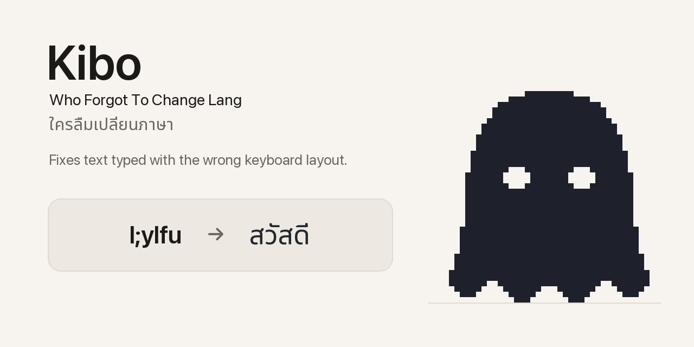

# Kibo

**Who Forgot To Change Lang** · ใครลืมเปลี่ยนภาษา

[](https://github.com/pmrster/kibo/releases/latest)
[](#install)
[](LICENSE)
[](PRIVACY.md)

A macOS menu-bar utility that fixes text typed with the wrong keyboard layout — Thai Kedmanee
against US QWERTY, in either direction or both at once. Local-only, sandboxed, no network.
Named after its mascot, a small pixel ghost.

<picture>
  <source media="(prefers-color-scheme: dark)" srcset="docs/banner-dark.png">
  
</picture>

Type `l;ylfu` when you meant `สวัสดี`? Paste it in and get it back.

```
l;ylfu ้ำสสน ครับ 2024 :)   →   สวัสดี hello ครับ 2024 :)
```

Note what *didn't* change. `ครับ` was already correct, `2024` is a number, `:)` is a smiley. Mixed
mode converts only the parts that are actually broken.

*Kedmanee is the standard Thai keyboard layout, the one every Thai Mac ships with. Its keys sit
where a US QWERTY keyboard puts letters and punctuation, so forgetting to switch layouts turns
what you typed into an unrelated string of the other script — never a blank, always wreckage.*

<p align="center">
  <picture>
    <source media="(prefers-color-scheme: dark)" srcset="docs/mockup-converter-dark.png">
    
  </picture>
  <br>
  <sub>Mockup, rendered from the app's own palette and sprite by <code>Tools/make-mockups.py</code>. Real captures will replace it.</sub>
</p>

| | |
| --- | --- |
| **Status** | Pre-1.0. Converter, menu-bar app, and the Services item all work. Builds are ad-hoc signed until a Developer ID is provisioned. |
| **Requires** | macOS 14 (Sonoma) or later, Apple silicon or Intel |
| **Stack** | Swift 6, SwiftUI, AppKit, SwiftPM, XCTest. No dependencies. |
| **Privacy** | Local-only, and sandboxed with no network entitlement — [verify it yourself](#privacy). |

## Install

**[Download Kibo.dmg](https://github.com/pmrster/kibo/releases/latest/download/Kibo.dmg)** — the
latest release, for macOS 14 or later. Open it and drag **Kibo** to `/Applications`. Every
release, with its SHA-256 beside it, is on the [Releases](https://github.com/pmrster/kibo/releases)
page.

No notarized build is published yet, so macOS will not trust a downloaded copy on sight. On first
launch, right-click the app → **Open** once, and it will not ask again. If you would rather not
do that, build it yourself — the result is the same app:

```bash
git clone https://github.com/pmrster/kibo.git && cd kibo
Packaging/package.sh
open dist/
```

## Using it

<picture>
  <source media="(prefers-color-scheme: dark)" srcset="docs/kibo-boo-dark.gif">
  
</picture>

The app has no Dock icon. Look for the small pixel ghost in the menu bar — that's **Kibo**. Open
it and Kibo is there too, perched on the top edge of the input box. It blinks while it waits,
shuts its eyes after a copy, and says *boo~*.

- **Left-click** the glyph to open the converter. Paste, read the result, copy.
- **Right-click** for About, Settings, and Quit.
- **Pin** (top-right of the window, or `⇧⌘P`) floats the converter above other apps, so it stays
  put while you switch away to paste.
- **Fix it where it is.** Select mistyped text in any app, right-click → **Services** → **Fix
  Layout with Kibo**, and the selection is replaced in place, in whatever mode the converter is
  set to. There is no preview on this path, so `⌘Z` in that app is the undo. To make it a hotkey,
  give it a shortcut in System Settings → Keyboard → Keyboard Shortcuts → Services → Text.
- **Open at login** is a switch in Settings, off by default.

### Four modes

| Mode | Key | What it does |
| --- | --- | --- |
| **Both** | `⌘1` | Flips every run the way its own script implies, in one pass — for text mistyped in *both* directions at once. |
| **EN → TH** | `⌘2` | Treats the whole string as English keystrokes typed with the Thai layout on. |
| **TH → EN** | `⌘3` | The reverse. |
| **Mixed** | `⌘4` | Converts only the runs that look wrong. Leaves correct text, numbers, and punctuation alone. |

Kibo opens in **Both**, and reopens in whatever mode you last used. Hover a mode for a Thai
explanation of what it does — the labels are too short to say it, and the difference that matters
(Both converts correct text, Mixed spares it) is worth spelling out.

The first three are mechanical — they flip everything, no judgement — and they are the escape
hatch for when Mixed guesses wrong. **Both** is the one to reach for when you switched layout
partway through a sentence, so half of it is wrong each way: no single direction can fix that.

### Shortcuts

Everything happens as you type, and the whole flow works without a mouse:

| Action | Shortcut |
| --- | --- |
| Copy result | `⇧⌘C` |
| Paste | `⇧⌘V` |
| Clear | `⇧⌘K` |
| Swap direction | `⇧⌘S` |
| Pin as floating window | `⇧⌘P` |
| Change mode | `⌘1` – `⌘4` |

## How Mixed decides

Thai spelling has hard structural rules, and typing English on the Thai layout breaks them almost
immediately — vowel marks land with no consonant to attach to:

```
"email" typed on the Thai layout  →  ำทฟรส
                                     ↑ a vowel mark with nothing to attach to → broken → converted

ครับ                                 ค(consonant) ร(consonant) ั(mark, attached) บ(consonant)
                                     → every rule satisfied → left alone
```

No dictionary is involved, which matters: written Thai has no spaces, so `สวัสดีครับ` arrives as a
single run and a dictionary would need to segment it first.

**Mixed is tuned to never break correct text, which means it misses things.** Wreckage that
happens to be well-formed passes through — `แนกำ` (which was "code") breaks no rule, and `นา`
(which was "ok") is a real Thai word.

| | |
| --- | --- |
| Correct text left untouched | **36 of 36** sampled — acronyms, URLs, paths, code, English, numbers, Thai |
| English mistypings fixed | **19 of 30** sampled |
| Thai mistypings fixed | **4 of 12** sampled |

That ordering is deliberate: leaving a mistyping is recoverable — you see it and switch to an
explicit mode — whereas mangling text you'd typed correctly is not. All three figures are measured
by `MeasuredAccuracyTests`, which fails if any of them changes, and every case is also written
into `Fixtures/conversion-cases.json` so a port has to hold the same line. Three obvious ways to
raise recall were measured and rejected; `CLAUDE.md` records them so nobody tries a fourth time
without new evidence.

## Privacy

Kibo is the kind of tool you paste a password into, having typed it with the wrong layout. It is
built on that assumption.

- **No network — enforced, not promised.** The app runs in the macOS App Sandbox with no network
  entitlement, so it *cannot* open a connection. Check the running app yourself:
  `lsof -a -p $(pgrep -x Kibo) -i` — no output means no sockets. (The `-a` matters: without it
  `lsof` ORs its filters and shows you every other program's network activity.)
- **The clipboard is touched only when you ask.** Read on Paste, written on Copy, never watched or
  polled. Copies are marked *concealed* and *transient*, the flags clipboard managers use to keep
  passwords out of their history. The Services item never touches the clipboard at all: macOS
  hands the selection over on a private pasteboard that exists for that one call.
- **Nothing you type is stored.** Preferences hold your theme, text size, and last mode. That's
  it. Window restoration is switched off so the text cannot reach disk that way either.
- **One caveat, honestly.** Right-clicking inside a text field gives you the standard macOS menu,
  which includes Look Up and Translate — both send the selected text to Apple. Kibo neither uses
  nor can see that; it is the OS's menu, and it acts only when you pick an item from it.

See [`PRIVACY.md`](PRIVACY.md) for the full account and how to verify each claim, and
[`SECURITY.md`](SECURITY.md) for how to report a problem privately.

## Development

```bash
swift build
swift test                # the suite is the accuracy contract — see above
swift run Kibo            # the glyph appears top-right; quit with pkill -x Kibo

# Render the UI to PNGs without a display, for design review (light + dark):
swift run -Xswiftc -DKIBO_SNAPSHOT Kibo --snapshot ./assets
```

The key table is not hand-written — it is dumped from macOS's own layout data, which is how two
keys a hand table had backwards were caught:

```bash
swift Tools/dump-kedmanee.swift
```

`Fixtures/conversion-cases.json` is a language-neutral behaviour contract: the full 94-key table,
the typographic substitutions an OS makes on the user's behalf, a `schema` block describing the
format, and 136 cases across all four modes — including every string in the precision corpus and
every known miss. A future Windows port has to pass the same file, and passing it means holding
the same accuracy figures, not just the easy cases.

### Project layout

| Path | What |
| --- | --- |
| `Sources/KiboCore/` | All logic, zero AppKit/SwiftUI. Fully unit-tested. |
| `Sources/Kibo/` | The SwiftUI/AppKit shell: status item, panel, views, the mascot. |
| `Tests/KiboCoreTests/` | The suite, including the pinned accuracy corpus. |
| `Fixtures/` | The portable behaviour contract. |
| `Packaging/` | `package.sh`, `Info.plist`, the sandbox entitlements. |
| `Tools/` | The key-table dump, and the renderers for the banner, the mockups and the ghost GIFs. |
| `docs/` | The banner, mockups and GIFs this README uses. |

`CLAUDE.md` is the architecture document — commands, the conversion path, the privacy invariant,
and the decisions that were measured rather than guessed. `SPEC.md` has the product behaviour,
`PLAN.md` the sequencing, and `CHANGELOG.md` the history. Read
[`CONTRIBUTING.md`](CONTRIBUTING.md) before opening a pull request; it is short, and two of its
rules are the ones a well-meaning change most easily breaks.

## Related

A spin-off of [**Tama**](https://github.com/pmrster/tama), a menu-bar pixel cat that watches local
AI agent sessions. This app forks Tama's shell — the SwiftPM layout, theming, panel chrome and
packaging — and follows its approach to pixel-art character work, but Kibo is its own. Tama keeps
the cat and its "meow~"; Kibo gets the "boo~". Separate repos, separate releases.

## License

[MIT](LICENSE).
